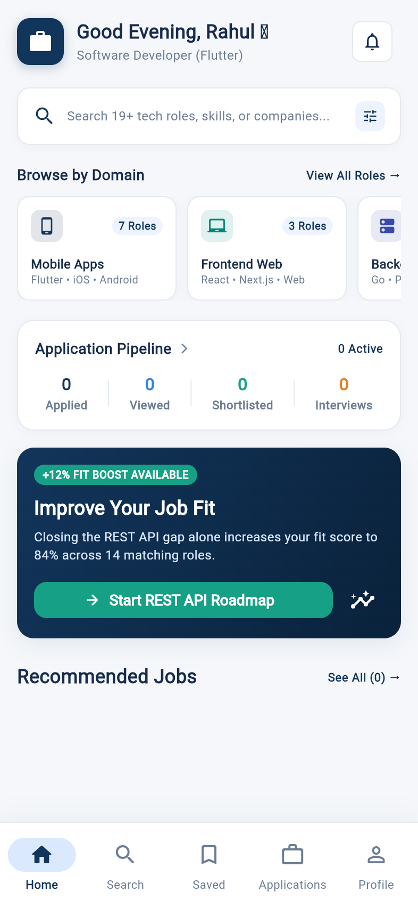
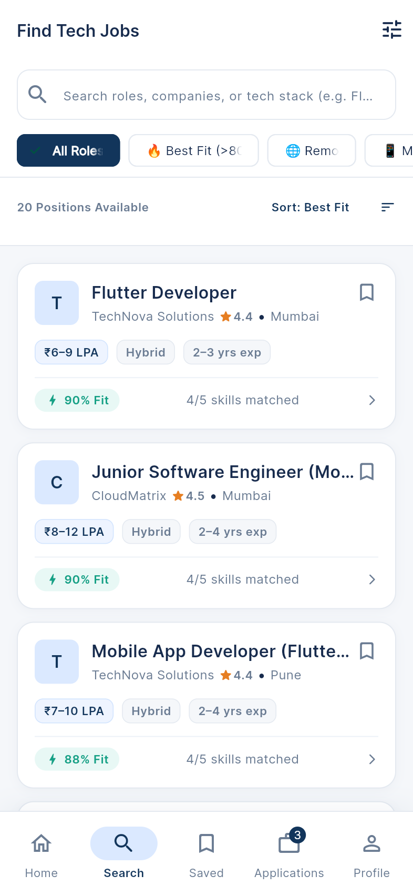
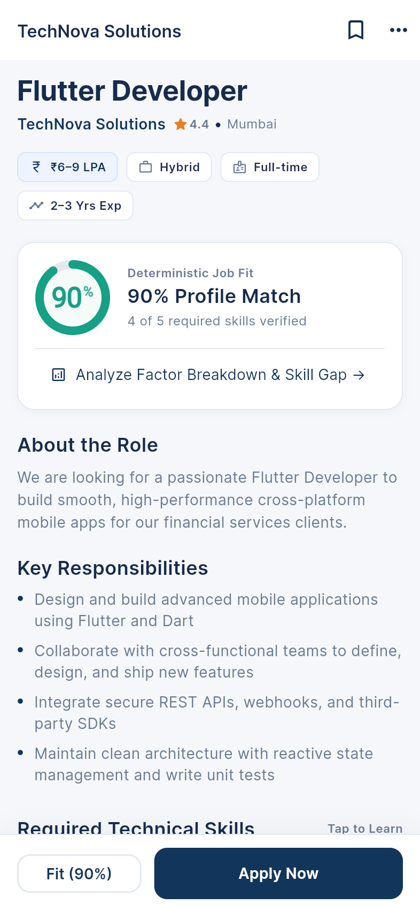
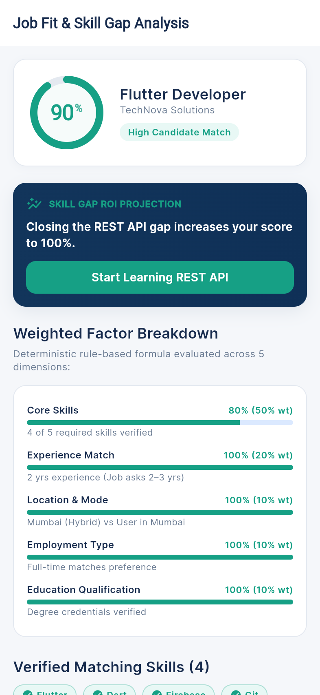
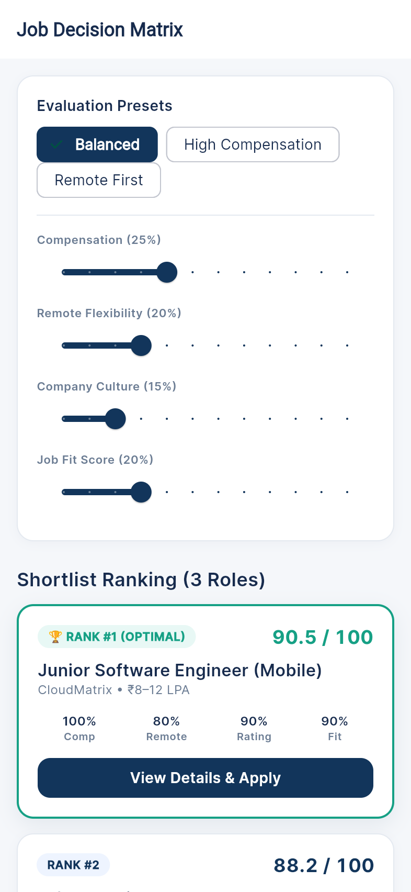
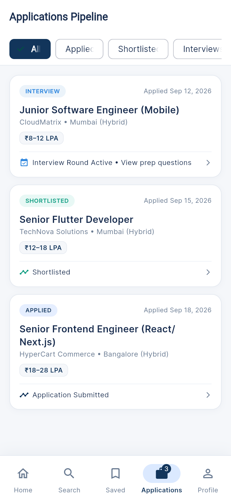
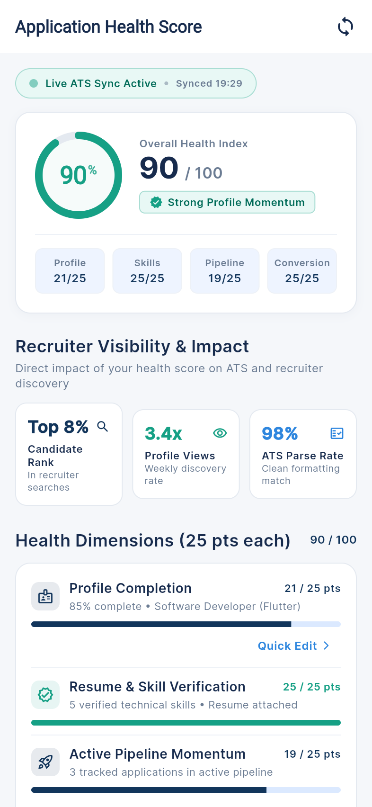
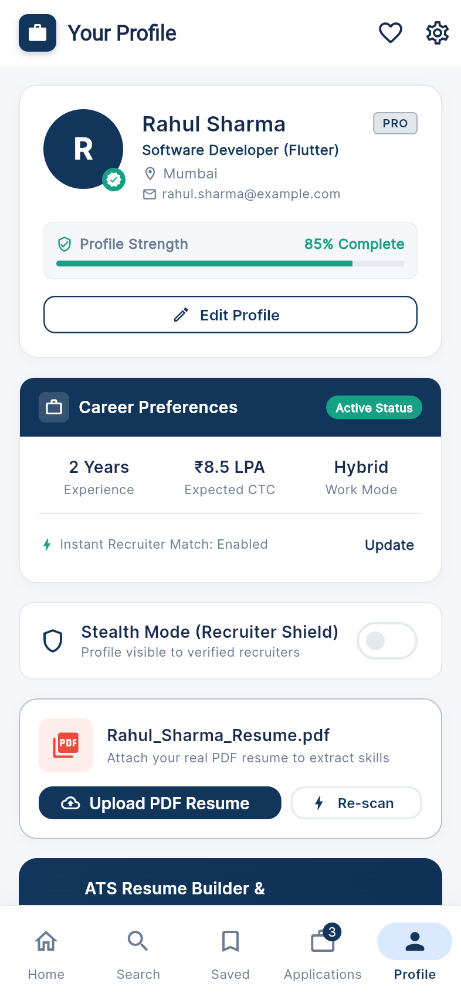
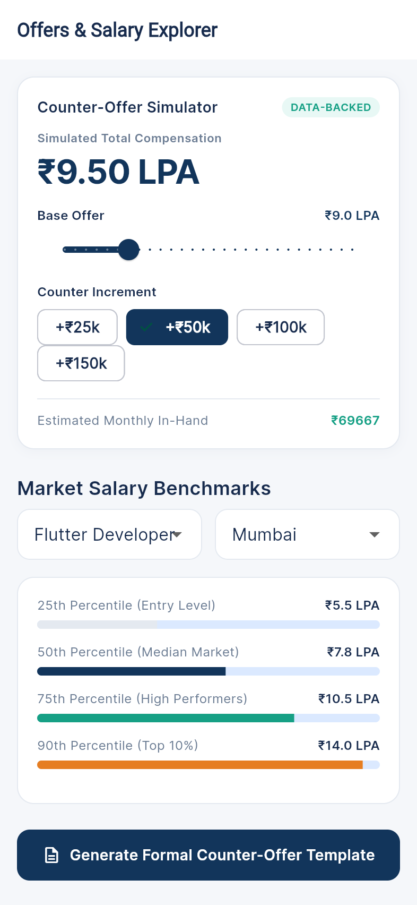
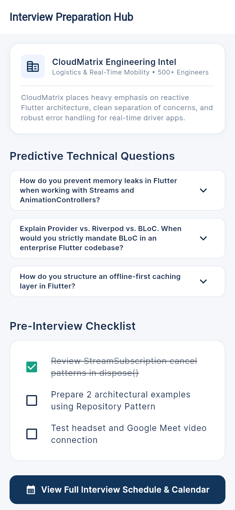

# HireHub

A comprehensive career management and job search platform built with Flutter and Firebase.

## Overview

Job hunting often feels like an unstructured numbers game. Candidates submit applications across dozens of job boards without clear visibility into why they do or don't hear back, which technical qualifications are holding them back, or how to systematically compare competing offers when considering trade-offs between compensation, remote work flexibility, and company culture.

**HireHub** bridges this gap by transforming the job hunt into a structured, data-informed workflow. Built as a cross-platform mobile and web application, HireHub combines deterministic job-fit matching, local PDF resume extraction, multi-attribute decision matrices, and interview preparation tools into a single unified workspace.

### Core Capabilities

- **Deterministic Fit & Skill Gap Analysis**: Evaluates roles using a 5-factor scoring model (Skills 50%, Experience 20%, Location 10%, Job Type 10%, Education 10%). For every listing, candidates see verified matching skills, missing requirements, and a simulated projection showing how their match score increases if they learn those missing skills.
- **Multi-Criteria Decision Matrix**: Compare opportunities side-by-side and rank offers using customizable criteria weights or presets (*Balanced*, *High Compensation*, *Remote First*) across salary, remote flexibility, culture ratings, and role alignment.
- **On-Device Resume Extraction**: Parses uploaded PDF resumes directly on the device using low-level byte-stream extraction (supporting compressed FlateDecode streams and embedded font glyph CMaps) to detect technical stacks without sending documents to third-party services.
- **Application Pipeline & Health Score**: Tracks application progress across 6 recruitment stages (Applied, In Review, Shortlisted, Interview, Offer, Rejected) while calculating a 100-point Application Health Index that analyzes search momentum, resume completeness, and interview conversion rates.
- **Career Growth Hub**: Includes role-tailored technical interview questions with model answers, pre-interview readiness checklists, city-based salary benchmarks, and an interactive counter-offer negotiation simulator.
- **Zero-Configuration Demo Mode**: Ships with a rich, realistic local seed dataset covering jobs, companies, applications, and candidate profiles—allowing anyone to explore all features immediately without requiring an initial Firebase setup.

---

## Screenshots

| Home Dashboard | Job Search | Job Details |
| :---: | :---: | :---: |
|  |  |  |

| Job Fit Analysis | Decision Matrix | Application Pipeline |
| :---: | :---: | :---: |
|  |  |  |

| Application Health Index | Candidate Profile | Salary & Offer Simulator |
| :---: | :---: | :---: |
|  |  |  |

<details>
<summary><b>View Interview Prep Hub Screenshot</b></summary>
<br>



</details>

---

## Features

### Job Search & Fit Analysis
- **Job Fit Score**: Matches your profile against job postings across 5 factors: skills (50%), experience (20%), location & work mode (10%), job type (10%), and education (10%).
- **Skill Gap Insights**: Identifies missing technical requirements for each job and simulates your projected fit score if you learn those skills.
- **Search & Filters**: Filter by work mode (remote, hybrid, on-site), job type (full-time, internship, contract), salary range, and experience level.

### Decision Matrix & Role Comparison
- **Side-by-Side Comparison**: Compare multiple jobs side-by-side across salary, work mode, company rating, and required qualifications.
- **Decision Matrix**: Rank offers or target roles using customizable criteria weights or presets (Balanced, High Compensation, Remote First) to find the best match for your priorities.

### Application Tracking
- **Pipeline Tracker**: Track applications across stages: Applied, In Review, Shortlisted, Interview, Offer, and Rejected.
- **Application Health Score**: A diagnostic score (0–100) based on profile completeness, resume readiness, active applications, and interview conversion rate with suggestions to improve your pipeline.

### Resume & Documents
- **On-Device Resume Parser**: Extracts technical skills and tools directly from PDF byte streams on the device, with support for compressed streams (FlateDecode) and font glyph mappings.
- **Resume Builder**: Build a clean resume within the app and export or print it as a formatted PDF.

### Career Tools & Privacy
- **Interview Prep**: Role-specific technical interview questions, answers, and a preparation checklist.
- **Interview Calendar**: Keep track of scheduled interview rounds with meeting links (Google Meet, Zoom).
- **Salary Explorer**: Review salary ranges across roles and cities, with an interactive counter-offer negotiation simulator.
- **Stealth Mode**: Toggle privacy settings to hide your active job-seeking status from current employers.

---

## Tech Stack

- **Framework**: Flutter 3.13+ (Dart 3.0+)
- **State Management**: Provider (`ChangeNotifierProvider` / `MultiProvider`)
- **Backend**:
  - Firebase Authentication
  - Cloud Firestore
  - Firebase Storage
- **Libraries**:
  - `pdf` & `printing` – In-app resume generation and export
  - `fl_chart` – Visual skill progress charts
  - `file_picker` – Cross-platform file selection (mobile, desktop, web)
  - `google_fonts` – Typography (Inter)
  - `archive` – Decompression support for document text parsing

---

## Project Structure

```
lib/
├── core/
│   ├── constants/       # Color palette, spacing, and typography tokens
│   ├── theme/           # Material 3 theme configuration
│   └── utils/           # Fit calculators, resume parser, decision matrix, safe parsers
├── data/
│   └── seed_data.dart   # Mock dataset for offline / demo mode
├── models/              # Strongly typed data models (Job, User, Application, etc.)
├── providers/           # ChangeNotifier state controllers
├── screens/             # Feature-first UI screens
│   ├── applications/    # Application pipeline & details
│   ├── auth/            # Sign in & registration
│   ├── home/            # Dashboard & recommended jobs
│   ├── interviews/      # Interview calendar & prep hub
│   ├── jobs/            # Details, fit analysis, comparison, decision matrix
│   ├── profile/         # Profile management & PDF resume builder
│   ├── salary/          # Salary explorer & negotiation simulator
│   ├── search/          # Search screen with dynamic filters
│   └── settings/        # App preferences, stealth mode & health diagnostic
├── services/            # Firestore, Auth, and Storage wrappers
└── widgets/             # Reusable UI components
```

---

## Getting Started

### Prerequisites

- [Flutter SDK](https://docs.flutter.dev/get-started/install) (>= 3.13.0)
- [Dart SDK](https://dart.dev/get-dart) (>= 3.0.0)
- iOS Simulator, Android Emulator, or a desktop/web browser

### Setup

1. **Clone the repository**
   ```bash
   git clone https://github.com/Vrutti88/HireHub.git
   cd HireHub
   ```

2. **Install dependencies**
   ```bash
   flutter pub get
   ```

3. **Run the app**
   ```bash
   # Mobile or connected device
   flutter run

   # Web
   flutter run -d chrome

   # macOS desktop
   flutter run -d macos
   ```

> **Demo Mode**: The app includes built-in sample data (`seed_data.dart`). If Firebase is not configured or offline, HireHub automatically runs in demo mode with sample jobs, applications, and profiles so you can test all features right away.

### Firebase Configuration (Optional)

To connect your own Firebase project:
1. Create a project in the [Firebase Console](https://console.firebase.google.com/).
2. Enable **Authentication** (Email/Password) and **Cloud Firestore**.
3. Run the FlutterFire CLI:
   ```bash
   dart pub global activate flutterfire_cli
   flutterfire configure
   ```
4. This will regenerate `lib/firebase_options.dart` with your project's credentials.

---

## Running Tests

All core algorithms and parsing logic are covered by unit and widget tests:

```bash
flutter test
```

Test suites include:
- `job_fit_calculator_test.dart` – Validates the 5-factor scoring formula and ROI boost simulations.
- `skill_gap_analyzer_test.dart` – Tests missing skill detection and proficiency threshold logic.
- `decision_matrix_test.dart` – Verifies multi-factor job rankings and preset weight calculations.
- `application_health_calculator_test.dart` – Checks 4-subfactor scoring and tip recommendations.
- `resume_parser_test.dart` – Tests PDF byte extraction, font CMap translation, and tech alias normalization.
- `safe_parsers_test.dart` – Verifies null-safety and error resilience against malformed Firestore data.
- `widget_test.dart` – Validates app initialization and splash flow.

---

## License

This project is licensed under the MIT License - see the [LICENSE](LICENSE) file for details.
